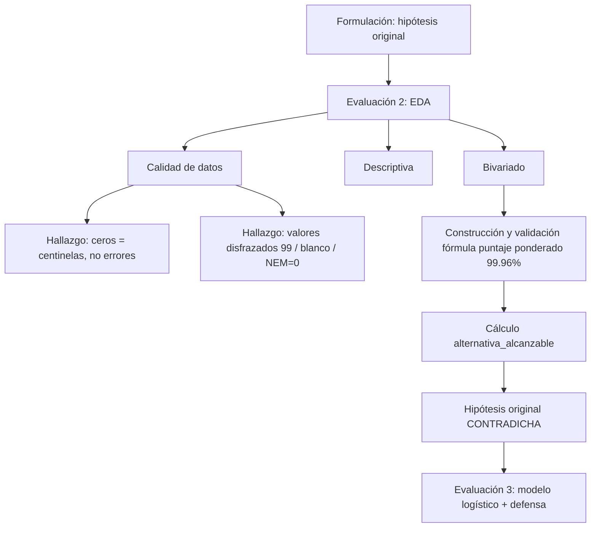

# Documento de referencia — "Quedar fuera teniendo puntaje"
### Proyecto Capstone PAES 2026 · Daniela Contreras · Emanuel Nicklichen

**Propósito de este documento:** un lugar único al que recurrir si preguntan algo puntual — en la presentación oral, en el informe, o entre ustedes dos — sin tener que reabrir seis notebooks. No reemplaza a los notebooks (ahí está el código y las cifras completas), es el mapa para saber dónde está cada cosa y por qué se decidió así.

---

## 1. El proyecto, en una hoja

| | |
|---|---|
| **Pregunta** | En el proceso de admisión 2026, ¿qué proporción de estudiantes no seleccionados en ninguna de sus preferencias tenía puntaje suficiente para haber sido seleccionada en al menos un programa con vacantes no cubiertas? ¿Existe diferencia por dependencia y/o nivel socioeconómico? |
| **Hipótesis original (formulación)** | La proporción con alternativa alcanzable es *mayor* en particulares pagados que en establecimientos públicos. |
| **Resultado** | **Contradicha.** Particular Pagado tiene la *menor* proporción (56,8%), no la mayor. Ver §8. |
| **Población** | 320.087 inscritos → 189.399 postulantes → 27.492 quedaron fuera de todas sus preferencias (el foco del proyecto). |
| **Fuente de datos** | datosabiertos.mineduc.cl, Centro de Estudios Mineduc / DEMRE, proceso 2026. |

---

## 2. Mapa mental del proceso analítico

**En texto, para quien no vea el diagrama:** formulación (hipótesis inicial) → EDA de calidad (encontramos que los "problemas" del dato eran en realidad reglas del sistema, no errores) → EDA descriptivo y bivariado → construcción propia de la fórmula de puntaje ponderado, validada al 99,96% → con esa fórmula, calculamos si cada uno de los 27.492 tenía alternativa alcanzable → el resultado contradice la hipótesis original → ahora construimos un modelo que formalice esto.

---

## 3. Las cinco tablas

| Tabla | Contenido | Tamaño | Llave |
|---|---|---|---|
| A — Inscritos y Puntajes | 1 fila por inscrito | 320.087 × 131 | `MRUN` |
| B — Socioeconómico | 1 fila por inscrito | 320.087 × 10 | `MRUN` |
| C — Postulantes y Selección | 1 fila por preferencia | 1.694.081 × 9 | `(MRUN, ORDEN_PREF, TIPO_PREF)` — **no** `(MRUN, ORDEN_PREF)` solo, ver §4 |
| D — Matrícula | 1 fila por matriculado | 146.873 × 10 | `MRUN` |
| Oferta Definitiva de Programas | 1 fila por programa | 2.150 × 23 | `COD_CARRERA` |

**Ruta de datos actual (post-consolidación):** `data/raw/2026/<carpeta-fuente>/*.csv` — con la subcarpeta del año, distinto de cómo empezamos.

---

## 4. Tabla maestra de decisiones de limpieza

| Variable | Lo que se encontró | Decisión tomada | Evidencia que la respalda |
|---|---|---|---|
| `CLEC_MAX`, `MATE1_MAX` | 13,47% / 14,63% en cero | Es centinela ("no rindió"), no puntaje real | Ver §9 — este es el punto que hay que reforzar de palabra |
| `MATE2_MAX` | 60,54% en cero | Prueba optativa; cero = no rindió | `ESTADO_PREF = 35` = "no rindió ninguna de las pruebas opcionales" |
| `HCSOC_MAX` | 38,63% en cero | Prueba optativa (par de `CIEN_MAX`) | Mismo código 35 |
| `CIEN_MAX` | 53,74% en cero | Prueba optativa (par de `HCSOC_MAX`) | Mismo código 35 |
| `PTJE_NEM`, `PTJE_RANKING` | 1,91% en cero (6.129 casos) | **No se excluyen** de la descriptiva; en la fórmula de puntaje ponderado se redistribuye el peso (ver §5) | Página oficial DEMRE "Postulantes extranjeros sin NEM": si cursaste enseñanza media en el extranjero, tus notas no ponderan — se redistribuye proporcionalmente entre las demás pruebas |
| `INGRESO_PERCAPITA_GRUPO_FA` | Código `99` en 27,61% (88.380) | Se excluye de cualquier análisis por decil; se reporta el % excluido | Diccionario oficial: 99 = "Prefiere no responder" |
| `PTJE_PREF` (tabla C) | 7,78% en blanco (`' '`, no `NaN`) | Se trata como faltante real; corresponde 100% a causales de anulación *previas* al cálculo del puntaje (nunca códigos 24/25/26) | Cruce contra `ESTADO_PREF`: todos los blancos caen en códigos 9,15,17,19,20,22,23,27-42,51,52 |
| `DEPENDENCIA` | Código en blanco en 1,00% (3.200) | Se excluye de análisis por dependencia; hipótesis de extranjería/revalidación no confirmada, queda anotada | Coincide en orden de magnitud con nulos de `NOMBRE_REGION_EGRESO` en `01_exploracion_datos` |
| `(MRUN, ORDEN_PREF)` en C | 280.569 "duplicados" | No es error: la llave real incluye `TIPO_PREF` (un estudiante puede tener la misma posición en REGULAR y en GENERO) | Ejemplo verificado: MRUN 89, preferencia 14, REGULAR y GENERO a la misma carrera (16109) |
| `HABILITACION_POST` | Formulación la resumía como "1 habilitado; 2 y 3 no habilitado" | Se documentó la fórmula oficial exacta | Diccionario: 1 = promedio `CLEC_MAX`/`MATE1_MAX` ≥458 y ciencias/historia rendida; 2 = promedio <458 pero `PORC_SUP_NOTAS`=10% y ciencias/historia rendida; 3 = no cumple ni 1 ni 2 |
| Ponderaciones Oferta (`HSCO`+`CIEN`) | 1.411 de 2.150 programas "no sumaban 100" | No es error: `HSCO`/`CIEN` es **un cupo único** (se usa el mejor puntaje del estudiante entre ambas, no se suman los pesos) | Verificado contra tabla real de requisitos (Arquitectura, U. de Chile, admisión 2027): NEM10+Ranking20+CLEC20+M1 30+M2 10+(Historia o Ciencias)10 = 100% |
| Residuo tras la corrección HSCO/CIEN | Bajó de 1.411 a 10 programas | Los 10 son carreras artísticas (Danza, Teatro, Música, Actuación) | Confirmado con fuente real: Danza (U. de Chile) exige además una "Prueba Especial" que pesa 50% del puntaje final, no capturada en esta base |
| Merge A + D | Solo 141.402 de 146.873 matriculados calzan con inscritos PAES | 5.471 matriculados (3,73%) entran por vías ajenas al proceso PAES (segunda carrera, titulados) | Verificado: esos `MRUN` no aparecen en A en absoluto |

---

## 5. La fórmula del puntaje ponderado — cómo se construyó y validó

**Construida por el equipo, sin ver el código de nadie más.** Componentes:

1. Para cada programa, se toman sus ponderaciones (`NEM`, `RANKING`, `CLEC`, `M1`, `M2`, en %).
2. `HSCO`/`CIEN`: si el programa exige ambas (cupo alternativo), se usa `MAX(HCSOC_MAX, CIEN_MAX)` del estudiante con el mayor peso entre las dos columnas — **no se suman los pesos**.
3. Si `PTJE_NEM=0` o `PTJE_RANKING=0` (posible extranjero sin NEM): se redistribuye proporcionalmente el peso de NEM+Ranking entre las demás pruebas, en vez de multiplicar por 0. Fórmula: `factor = 100 / (peso_clec + peso_m1 + peso_hc + peso_m2)`, y cada peso restante se multiplica por ese factor.
4. `puntaje_calculado = Σ(puntaje_estudiante_i × peso_ajustado_i) / 100`

**Validación:** se comparó contra `PTJE_PREF` real (el puntaje que DEMRE ya calculó) para las 1.328.381 preferencias `REGULAR` con puntaje real disponible.

> **Resultado: coincide en el 99,96% de los casos (error < 0,5 puntos). Quedan 472 discrepantes, de los cuales 407 (86,2%) corresponden exactamente a las 10 carreras artísticas de §4.** Los 65 restantes no tienen causa identificada — se documenta como residuo honesto, no se oculta.

**Ejemplo concreto para citar si preguntan "¿cómo saben que la fórmula funciona?":** MRUN 822.926, postulación a Medicina. Antes de aplicar la redistribución (multiplicando NEM/Ranking en cero por su peso): puntaje calculado 400,2 vs. real 727,64 (error enorme). Con la redistribución aplicada: **727,64 vs. 727,64 — coincidencia exacta.**

---

## 6. Cálculo de "alternativa alcanzable" — metodología

- **Población:** los 27.492 que no quedaron seleccionados en ninguna preferencia (verificado exacto: nadie con `ESTADO_PREF` en {24, 26} en ninguna fila).
- **Área de interés (decisión de fase inicial, documentada explícitamente):** las carreras —por *nombre*, no código exacto de programa— que el estudiante ya incluyó en su propia lista, en cualquier universidad. No se evalúa contra los 2.150 programas completos.
- **"Vacantes no cubiertas":** se calcula contra **matrícula real** (tabla D), no contra seleccionados (tabla C) — así calzan exactamente los 16.228 cupos sin llenar que reporta la formulación. Un cupo puede tener seleccionado y aun así quedar vacío si esa persona no se matricula.
- **Corte real:** el mínimo puntaje ponderado entre los seleccionados efectivos (`ESTADO_PREF = 24` exactamente; el código 26 = "seleccionado antes" no compitió realmente por ese cupo).
- **Regla de decisión:** tiene alternativa alcanzable si su puntaje calculado supera el corte real de **al menos un** programa de su área de interés con cupo sin llenar.
- **Excluidos de este cálculo específico:** ninguno actualmente (los casos NEM/Ranking=0 se resuelven con la redistribución de §5, no se excluyen).

**Escala del cálculo:** 89.874 pares (estudiante, carrera de interés) → 730 programas candidatos (cupo libre + corte conocido) → 471.882 pares (estudiante, oportunidad) evaluados por producto de matrices → 24.741 de 27.492 tuvieron al menos una oportunidad para evaluar.

---

## 7. Números que hay que tener a mano

| Métrica | Valor |
|---|---|
| Quedaron fuera de todas sus preferencias | 27.492 |
| Con alternativa alcanzable | 20.336 (**73,97%**) |
| Sin alternativa alcanzable | 7.156 (26,03%) |
| % con alternativa — Particular Pagado | **56,8%** (el más bajo) |
| % con alternativa — resto de dependencias | 73,7% – 79,8% |
| Mejor puntaje promedio — grupo SIN alternativa | 713,4 |
| Mejor puntaje promedio — grupo CON alternativa | 619,7 |
| Oportunidades promedio evaluadas — Particular Pagado | 12,8 |
| Oportunidades promedio evaluadas — resto | 18-24 |
| Validación fórmula puntaje ponderado | 99,96% (472 discrepantes, 86,2% con causa conocida) |

---

## 8. El giro de la hipótesis — explicación completa

**Lo que se esperaba:** Particular Pagado tendría *más* alternativas alcanzables (por mayor puntaje/recursos).

**Lo que se encontró:** Particular Pagado tiene *menos* (56,8% vs. 73,7-79,8%).

**Por qué — verificado, no especulado:**
1. No es por falta de puntaje: Particular Pagado tiene el puntaje promedio más alto del sistema (§3 de `S3_Bivariado`, brecha de 160 puntos entre extremos de dependencia).
2. Se verificó que no es por falta de oportunidades en general: el % de estudiantes sin *ninguna* oportunidad para evaluar es similar entre dependencias (8-13%).
3. La diferencia real está en cuántas oportunidades hay, en promedio, entre quienes sí tienen alguna: **12,8 en Particular Pagado vs. 18-24 en el resto.**
4. **Interpretación (plausible, no la única posible):** los estudiantes de Particular Pagado concentran su interés en carreras más selectivas, donde a nivel nacional casi ningún programa de esa misma carrera tiene cupos sin llenar — su "colchón" de sustitutos es más angosto, independientemente de su puntaje.

**Frase para memorizar, si preguntan "¿por qué se da vuelta la hipótesis?":** *"No es un problema de capacidad, es un problema de margen de sustitución: apuntan más alto y tienen menos alternativas de respaldo dentro de ese mismo rango."*

---

## 9. El punto delicado: cómo justificar que el cero es "no rindió" (CLEC_MAX / MATE1_MAX)

**Qué se hizo originalmente (y que NO aparece en los notebooks entregados):** se cruzó `CLEC_MAX = 0` contra `FORMA_REG_CL` y `FORMA_INV_CL` (el código de cuadernillo asignado en cada rendición 2026) y contra `CLEC_REG_ANTERIOR`/`CLEC_INV_ANTERIOR` (puntaje de procesos previos). Resultado: **43.124 de 43.126 casos (99,995%) no tienen cuadernillo asignado en ninguna sesión de 2026 ni puntaje válido en ningún proceso anterior.** Es evidencia administrativa —asignación de cuadernillo— completamente independiente del puntaje mismo. Se repitió para `MATE1_MAX`: 100% exacto.

**Por qué esto es más fuerte que lo que sí quedó escrito (el "rescate del 5,7%"):** el argumento del rescate solo muestra que `CLEC_MAX` recoge puntajes de otros procesos que `CLEC_REG_ACTUAL` no ve — no prueba que un `CLEC_MAX = 0` específicamente signifique "nunca rindió". Es un argumento *relacionado* pero no es la misma prueba. El del cuadernillo sí lo es, porque usa un dato que no depende del puntaje en absoluto.

**Si preguntan en la presentación o el informe "¿cómo verificaron que el cero no es un error de digitación o un puntaje real muy bajo?":**

> *"Cruzamos los casos de puntaje cero contra el código de cuadernillo asignado en cada sesión de rendición — un dato administrativo, no un puntaje — y contra los puntajes de procesos anteriores. En el 99,99% de los casos, no había cuadernillo asignado en ninguna sesión ni puntaje previo. Es decir, el estudiante nunca se presentó físicamente a rendir la prueba en ninguna de las cuatro instancias posibles. No es un error de registro ni un desempeño real de cero puntos."*

Esto no está en los seis notebooks entregados a evaluación — quedó fuera durante la edición de storytelling. No se puede agregar retroactivamente a esa entrega, pero **sí conviene tenerlo de memoria para la defensa oral**, y es candidato natural para reintroducirse en el notebook nuevo del modelo (si el modelo usa estas variables como predictoras, esta verificación respalda por qué se trataron como centinela).

---

## 10. Decisiones metodológicas que hay que poder defender como decisión, no como accidente

- **Por qué `MAX(HSCO, CIEN)` y no la suma:** verificado contra tabla oficial real (§4). Sin esto, el 65,6% de los programas "no sumaban 100" — con esto, solo el 0,47%.
- **Por qué área de interés = carrera por nombre, no código exacto de programa:** decisión explícita de fase inicial (el diplomado dura 6 meses); permite capturar el "conjunto de sustitución" entre universidades que menciona la formulación, sin necesitar aún una clasificación más fina por familia de carreras.
- **Por qué el "cupo sin llenar" se mide contra matrícula real y no contra selección:** validado exacto contra el número de la formulación (16.228); una selección no garantiza que el cupo se ocupe.
- **Por qué no se usa chi-cuadrado/Cramér's V en las tablas de contingencia:** no se vio en clase (solo `pd.crosstab` con porcentajes) — se sacó explícitamente al notar la inconsistencia.
- **Por qué no hay Ridge/Lasso todavía:** solo se justifica con muchas variables correlacionadas entre sí sin capacidad de elegir con criterio de negocio cuál usar; para el primer modelo (regresión logística simple) no aplica — se deja como paso siguiente.

---

## 11. Lo que aún no está resuelto (para no improvisar una respuesta si preguntan)

- Por qué exactamente el resto de dependencias (fuera de Particular Pagado) tiene un patrón tan parecido entre sí (73,7% a 79,8%) — no se ha explorado si hay sub-diferencias dentro de ese grupo.
- Los 65 casos discrepantes de la validación del puntaje ponderado sin causa identificada (§5).
- Si la definición de "área de interés" por nombre exacto de carrera sobre- o subestima las alternativas reales (carreras con nombres ligeramente distintos entre universidades podrían no calzar como texto idéntico).
- El mecanismo exacto por el cual Particular Pagado concentra carreras con menor margen de sustitución — es una interpretación plausible, no confirmada con una prueba directa.

---

## 12. Glosario rápido

| Término | Significado |
|---|---|
| `MRUN` | Identificador anonimizado del estudiante, estable entre procesos |
| `_MAX` vs `_REG_ACTUAL` | `_MAX` = mejor puntaje entre todas las rendiciones vigentes; `_REG_ACTUAL` = solo el proceso regular del año en curso |
| `HABILITACION_POST` | Si el estudiante cumple el mínimo para postular (fórmula exacta en §4) |
| `DEPENDENCIA` | Tipo de establecimiento de egreso (Municipal, Particular Pagado, SLEP, etc.) |
| `TIPO_PREF` | Vía de la preferencia: REGULAR, BEA, PACE, GENERO |
| `ESTADO_PREF` | Resultado de una preferencia puntual (seleccionado, lista de espera, o alguna de las 15 causales de anulación) |
| Puntaje ponderado | El puntaje final de un estudiante para un programa específico, combinando NEM, Ranking y pruebas PAES según los pesos de ese programa |
| Alternativa alcanzable | Que el puntaje ponderado del estudiante supere el corte real de al menos un programa de su interés con cupos sin llenar |
